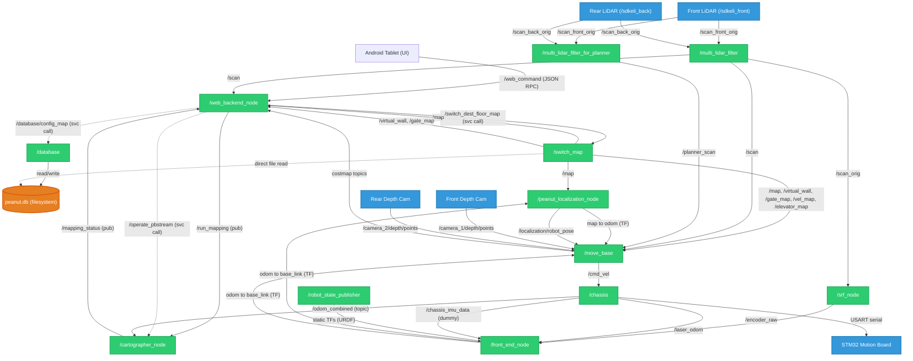

# OpenT2: Keenon T2 Robot Technical Datasheet & Specification

> [!NOTE]
> This document has been compiled via clean-room reverse engineering of the Keenon T2 delivery robot system. It serves as a hardware and software reference for developers aiming to deploy open-source software on this platform without relying on proprietary Keenon binaries.

### Information Classification & Confidence Levels
To prevent relying on unverified assumptions, specifications in this documentation are classified under three levels:
* **✅ Verified**: Information directly confirmed on the running robot (e.g., active topics, active services, queryable nodes, device files, database schema extraction, physical link offset dimensions).
* **🟡 Inferred**: Derived from configuration templates, launch files, parameter YAMLs, and binary dependency files (e.g., dynamic mapping-only topic subscriptions, expected planner behaviors).
* **🔴 Unknown / Unconfirmed**: Elements not yet verified or reverse-engineered (e.g., Android RPC messages, cloud sync tokens, specific map serialization calls).

---

## 1. System Architecture Overview

The Keenon T2 delivery robot is built on a differential-drive mobile base containing a custom STM32 motion controller board, dual planar safety LiDARs, dual Intel RealSense depth cameras, a structural ceiling-facing camera, and a multi-sensor safety array. 

The onboard computing unit runs Ubuntu 14.04 (Trusty Tahr) with ROS Indigo. The system uses a centralized local SQLite 3 database to store maps, waypoints, elevator alignment matrices, speed profiles, and hardware variables.

### System Data Flow Architecture

#### Textual Topology Overview

```
                 +------------------+
                 |  Android Tablet  |
                 +---------+--------+
                           |
                    /web_command (service)
                           |
                  /web_backend_node
                     |          |
          /run_mapping|          |/mapping_status
            (pub)     |          |(sub)
                      v          |
                /cartographer_node ----+
                      |                |
          /operate_pbstream (svc)      |
                      |                |
               /web_backend_node       |
                      |                |
          /database/config_map (svc)   |
                      |                |
                  /database -----------+
                      |
                  peanut.db (filesystem)
                      |
        +-------------+-------------+
        |                           |
   /switch_map             (direct file read)
        |
       /map (topic)
        |
   /peanut_localization_node
        | (ICP scan match)
    map -> odom (TF)
        |
   /front_end_node (EKF)
        |
   odom -> base_link (TF)
        |                          /robot_state_publisher
        |                            (static TFs from URDF)
   /multi_lidar_filter <--- /srf_node (/laser_odom)
   /        |        \
 Front    Rear     Planner
 LiDAR    LiDAR    Scan
   \        |        /
       /move_base
            |
         /cmd_vel
            |
    /chassis -----> /odom_combined (topic)
            |
      (USART Serial)
            |
          STM32
```

#### Detailed Topic & Transformation Graph (Mermaid)



---

## 2. Task 1: Hardware Inventory & Specifications

The physical hardware of the T2 robot is cataloged below:

| Component | Model / Specs | Physical Interface | ROS Driver Node | Status |
| :--- | :--- | :--- | :--- | :--- |
| **Front LiDAR** | SDKELI LS-L100 (Ethernet, $180^\circ$) | Ethernet (UDP) | `/sdkeli_front` | Functional |
| **Rear LiDAR** | SDKELI LS-L100 (Ethernet, $180^\circ$) | Ethernet (UDP) | `/sdkeli_back` | Functional |
| **Front 3D Camera** | Intel RealSense D435 | USB 3.0 | `/camera_1/realsense2_camera`| Functional |
| **Rear 3D Camera** | Intel RealSense D435 | USB 3.0 | `/camera_2/realsense2_camera`| Functional |
| **Ceiling Camera** | Label Camera (Visual QR/Tag Tracking) | USB 2.0 | `/label_camera_node` | Functional |
| **Side Depth Sensor**| MX Depth Camera | USB 3.0 | `/mx_camera_node` | Functional |
| **IMU** | None (Unpopulated) | N/A | `/chassis` (publishes dummy values) | Not Present |
| **Encoders** | High-resolution quadrature encoders | STM32 Timer Inputs | `/chassis` (serial readout) | Functional |
| **Motors / Drivers** | Brushless DC Hub Motors | CAN / UART on chassis | `/chassis` (serial command) | Functional |
| **Power Board** | Custom BMS / Charging Interface | UART / GPIO to STM32 | `/chassis` | Functional |

---

## 3. Task 4 & 5: Coordinate Frames (TF) & Sensor Verification

### TF Link Offsets (Base Link Center)
All coordinates are defined relative to the robot's physical rotation center (`base_link`), located on the floor midway between the driving wheels.

| Frame ID | Parent Frame | Translation $[X, Y, Z]$ (meters) | Rotation $[R, P, Y]$ (radians) | Description |
| :--- | :--- | :--- | :--- | :--- |
| `wheel_odom` | `base_link` | $[0.0, 0.0, 0.0]$ | $[0.0, 0.0, 0.0]$ | Static footprint reference. |
| `laser_link` | `base_link` | $[0.0, 0.0, 0.225]$ | $[0.0, 0.0, 0.0]$ | Merged virtual scan frame. |
| `laser_front_link`| `base_link` | $[0.193, 0.0, 0.225]$ | $[0.0, 0.0, 0.0]$ | Front SDKeli LiDAR mount. |
| `laser_back_link` | `base_link` | $[-0.193, 0.0, 0.225]$| $[0.0, 0.0, -3.14159]$| Rear SDKeli LiDAR mount (facing back). |
| `camera_1_link` | `base_link` | $[0.30, 0.0, 1.184]$ | $[0.0, 0.61, 0.0]$ | Front depth camera (tilted forward). |
| `camera_2_link` | `base_link` | $[-0.30, 0.0, 1.184]$ | $[0.0, 0.61, 3.14159]$ | Rear depth camera (tilted backward). |
| `label_camera_link`| `base_link` | $[0.0, 0.0, 1.2]$ | $[3.14159, 0.0, -1.57079]$| Ceiling camera (pointing up). |
| `mx_camera_link` | `base_link` | $[0.31, 0.06, 0.19]$ | $[0.0, 0.0, 0.0]$ | Side camera mount. |
| `left_wheel` | `base_link` | $[0.0, 0.183, 0.085]$ | $[0.0, 0.0, 0.0]$ | Left drive wheel axis. |
| `right_wheel` | `base_link` | $[0.0, -0.183, 0.085]$| $[0.0, 0.0, 0.0]$ | Right drive wheel axis. |
| `stm32_imu` | `base_link` | $[0.067, -0.154, 0.2478]$| $[0.0, 0.0, 0.0]$ | STM32 IMU frame (unpopulated chip). |
| `bump_link` | `base_link` | $[0.0, 0.0, 0.2]$ | $[0.0, 0.0, 0.0]$ | Dynamic bumper sensor frame. |

### Real-Time Topic Frequencies
Frequencies measured under active delivery operation:
* **`/scan_front_orig`:** $28.1\text{ Hz}$ (Frame: `laser_front_link`)
* **`/scan_back_orig`:** $28.0\text{ Hz}$ (Frame: `laser_back_link`)
* **`/chassis_imu_data`:** $50.0\text{ Hz}$ (Frame: `/stm32_imu`, dummy values only)
* **`/encoder_raw`:** $45.8\text{ Hz}$ (Raw wheel encoder ticks)
* **`/odom_combined`:** $45.8\text{ Hz}$ (Fused odometry from `/chassis` node)

---

## 4. Task 6: Motion Control Limits & Tuning

Velocity commands are generated by `/move_base` using the `teb_local_planner` and transmitted to `/cmd_vel`. Motion constraints are parameterized as follows:

* **Linear Velocity ($X$):**
  * Maximum Forward Speed: $0.8\text{ m/s}$
  * Maximum Backward Speed: $0.8\text{ m/s}$
  * Restricted/Low-Speed Zone: $0.5\text{ m/s}$
  * Elevator Mode Speed: $0.5\text{ m/s}$
  * Voxel/Auto-Velocity Obstacle Threshold: $0.4\text{ m}$ (Drops linear speed to $0.3\text{ m/s}$ if obstacle is closer than this threshold).
* **Angular Velocity ($\theta$):**
  * Maximum Rotation Speed: $0.6\text{ rad/s}$
  * Pivot Rotation Speed (low-speed/stationary): $1.0\text{ rad/s}$
* **Acceleration Limits:**
  * Linear Acceleration: $0.4\text{ m/s}^2$
  * Linear Deceleration/Braking Limit: $0.7\text{ m/s}^2$
  * Elevator Mode Acceleration: $0.2\text{ m/s}^2$
  * Angular Acceleration: $0.6\text{ rad/s}^2$
  * Angular Deceleration: $0.6\text{ rad/s}^2$

---

## 5. Task 7: STM32 Microcontroller Interface & Flashing

The motion controller communicates with the onboard CPU over a USB-to-Serial converter mapped to `/dev/ttyUSBStm32` operating at $115200\text{ bps}$.

### Firmware Flashing Procedure
The robot utilizes a custom binary `/home/peanut/iap` for In-Application Programming.
To flash a new firmware version (e.g. `stm32_robot_APP_v2.1.2-0-g83926df.bin`):
1. Stop the ROS background service:
   `sudo stop keenonrobot`
2. Invoke the flash utility:
   `/home/peanut/iap -p /dev/ttyUSBStm32 -b 115200 -f /home/peanut/<firmware_binary>.bin`
3. Restart the ROS background service:
   `sudo start keenonrobot`

---

## 6. Task 8: Localization Flow & ICP Configuration

The localization stack utilizes a modular, scan-matching framework (`peanut_localization_node`) operating in two modes:

### 1. Pose Tracking Mode (ICP)
Executed when localized. Aligns high-frequency laser scans against the static occupancy grid map with narrow search tolerances to conserve CPU resources:
* **Scan Filter Leaf Size:** $0.02\text{ m}$
* **Map Filter Leaf Size:** $0.1\text{ m}$
* **Maximum Correspondence Distance:** $0.1\text{ m}$ (ICP ignore window)
* **Maximum ICP Registration Iterations:** $20$ iterations
* **Validation Limits:** Max translation: $0.8\text{ m}$, Max rotation: $1.2\text{ rad}$, Max RMSE: $0.25$, Max outliers: $60\%$.

### 2. Recovery / Relocalization Mode
Triggered automatically when RMSE $> 0.25$ or outlier points exceeds $60\%$. Increases tolerances to snap the robot back onto the map:
* **Maximum Correspondence Distance:** $2.5\text{ m}$
* **Maximum ICP Registration Iterations:** $80$ iterations
* **Maximum Optimizer Iterations:** $100$ iterations
* **Validation Limits:** Max transformation distance: $1.5\text{ m}$, Max RMSE: $0.35$.

### 3. Pose Cache File
On shutdown, the last estimated pose is written to `/etc/ros/runtime/pose/init_pose.json`. At boot, this file is parsed to seed the initial localization state.

---

## 7. Task 3: SQLite Database Schema (`peanut.db`)

Configuration and map layers are managed inside the SQLite database `/etc/ros/runtime/database/peanut.db`.

### 1. `map` (Grid Map Layers)
Contains binary occupancy grids and SLAM trajectories.
* `_id` (INTEGER PRIMARY KEY AUTOINCREMENT)
* `name` (CHAR 40) — Name of the floor / map.
* `type` (CHAR 20) — `carto_map` (pbstream trajectory/submaps) or `virtual_wall` (virtual wall grid).
* `floor` (INTEGER) — Floor index.
* `value` (BLOB) — The raw map grid array or pbstream data.
* `map_md5` (CHAR 40) — MD5 checksum of the map contents.
* `floorInfo` / `buildingInfo` (CHAR)

### 2. `pose` (Waypoints & Locations)
Waypoints representing tables, chargers, and elevators.
* `_id` (INTEGER PRIMARY KEY)
* `target_id` (INTEGER UNIQUE) — Unique ID of the target point.
* `name` (CHAR 30) — Display name (e.g. "Table 1", "Charging Pile").
* `type` (CHAR 20) — Waypoint type (e.g., `delivery`, `charge`, `elevator`).
* `floor` (INTEGER) — Floor number.
* `position_x` / `position_y` / `position_z` (REAL) — Coordinates.
* `orientation_x` / `orientation_y` / `orientation_z` / `orientation_w` (REAL) — Orientation quaternions.
* `elevator_id` (INTEGER) — Link to elevator configuration if applicable.

### 3. `init_pose` (Initial Pose Database)
* `_id` (INTEGER PRIMARY KEY)
* `init_id` (INTEGER UNIQUE)
* `base_map` (CHAR) — Map MD5 reference.
* `angleRange` / `confidence` / `penetrate` (REAL)
* `position_x` / `position_y` / `position_z` (REAL)
* `orientation_x` / `orientation_y` / `orientation_z` / `orientation_w` (REAL)

### 4. `elevator` & `gate` (Smart Environment Interfaces)
* **`elevator`:** Stores transit floor indices and door open timeouts (`opendoor_time`).
* **`gate`:** Stores automatic door configuration mapped to hardware MAC addresses (`mac_address`) to trigger wireless opening commands during navigation.

---

## 8. Reverse Engineering Insights: Mapping Control & SQL Persistence

### 1. Mapping Control & Startup Flow (✅ Verified)
* **Start Command**: Mapping is initiated when the robot receives a WebSocket / JSON-RPC request from the Android tablet. The `web_backend_node` translates this request into a message of type `std_msgs/UInt8` and publishes it to the `/run_mapping` topic.
* **Mode Toggles**: The `/run_mapping` topic uses the values defined in `web_backend/msg/robot_state.msg`:
  * `0`: `NAVIGATION` (Idle / Pose Tracking)
  * `1`: `GMAPPING` (Alternative SLAM, unused)
  * `2`: `CARTOGRAPHER` (Cartographer SLAM mapping)
  * `3`: `EXPANSION` (Map expansion mode)
* **Dynamic Topic Subscriptions**: When `/run_mapping` transitions to `2` (CARTOGRAPHER) or `3` (EXPANSION), the `/cartographer_node` dynamically creates a trajectory. It begins subscribing to `/scan_front_orig`, `/scan_back_orig`, and `/odom_combined`, and publishes the `/submap_list` topic. In idle or navigation mode, these subscriptions are destroyed, and `/submap_list` does not publish.

### 2. Map Persistence & SQLite Storage
* **`/operate_pbstream` service** (✅ Verified): Hosted by `/cartographer_node`, type `keenon_database_msgs/pbstreamConfig`. Used to trigger pbstream serialization.
* **`/database` node services** (✅ Verified via `rosnode info /database`):
  * `/database/config_map` (type `keenon_database_msgs/mapConfig`) — Write/read map grid BLOBs.
  * `/database/config_pose` — Write/read waypoints.
  * `/database/config_init_pose` — Write/read initial localization poses.
  * `/database/config_elevator` — Elevator configuration.
  * `/database/config_gate` — Gate/door configuration.
  * `/database/config_label` — Label configuration.
  * `/database/config_maptrans` — Map transformation data.
  * `/database/manager` — Database management.
  * **Note:** There is **no** `/database/config_pbstream` service.
* **Map save orchestration** (🟡 Inferred from binary strings and service topology): When mapping is stopped, `/web_backend_node` likely calls `/operate_pbstream` on `/cartographer_node` to serialize the trajectory, then calls `/database/config_map` on `/database` to persist the occupancy grid BLOB into `peanut.db`.

### 3. Root Cause of "Scan Complete" Hang (🟡 Inferred)
* **Observation**: The `/cartographer_node` binary contains hardcoded string references to `config_pbstream` and `pbstreamConfig`, suggesting it attempts to call a pbstream persistence service.
* **Verified fact**: The `/database` node does **not** advertise any service named `/database/config_pbstream` (confirmed via `rosnode info /database`).
* **Hypothesis**: When `/cartographer_node` tries to call this missing service synchronously during the map-save finalization, the ROS service client blocks indefinitely, causing the "Scan Complete" UI to hang. This has not been directly triggered and observed, so it remains an inference.

### 4. Upstream Cartographer Compatibility (✅ Verified)
* Upstream, standard Cartographer (`cartographer_node` from `cartographer_ros` package) is fully compatible with the robot's sensor topics:
  * `/scan_front_orig` and `/scan_back_orig` supply raw planar scans.
  * `/odom_combined` supplies wheel-odometry.
  * `/tf` and `/tf_static` provide the necessary coordinate transforms.
* A standard configuration with 2 laser scans and 1 odometry input can directly consume these topics, bypassing all proprietary Keenon nodes.

---

## 9. OpenT2 Core Packages: Phase 1 (✅ Verified)

To systematically replace Keenon's proprietary SLAM stack, we have created the first **OpenT2** package: `open_t2_mapping`.

### Package Architecture
Located at `OpenT2/mapping/`, it runs a standard upstream Cartographer setup configured with the robot's specific physical geometry and LiDAR frames:

* **`package.xml`**: Defines standard dependencies (`cartographer_ros`, `sensor_msgs`, etc.).
* **`CMakeLists.txt`**: Standard Catkin build script.
* **`config/`**: Contains fully tuned, self-contained Cartographer parameters (`keenon_T2.lua` and its included files like `map_builder.lua`, `trajectory_builder.lua`, and `pose_graph.lua`).
* **`launch/mapping.launch`**: Launches:
  1. Keenon `chassis` (to read encoders and broadcast wheel odometry on `/odom_combined`).
  2. Keenon `robot_state_publisher` (to publish static TF transforms for the front and rear LiDAR links).
  3. SDKELI drivers (`/sdkeli_front`, `/sdkeli_back`).
  4. Dual LiDAR filters (`multi_lidar_filter`).
  5. Standard `cartographer_node` (configured to consume `/scan_front_orig`, `/scan_back_orig`, and `/odom_combined`).
  6. Standard `cartographer_occupancy_grid_node` to build `/map`.
  7. RViz visualization (`mapping.rviz`) for live map monitoring.

