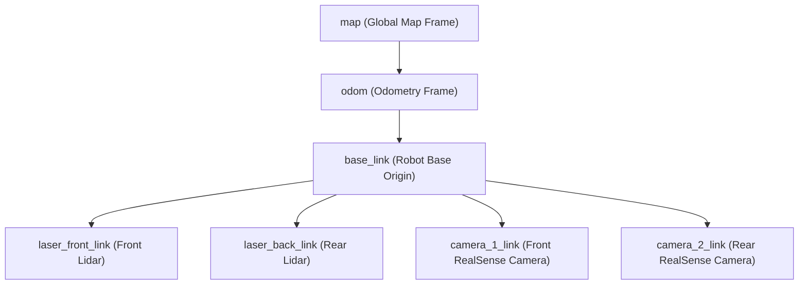

# Keenon T2 Delivery Robot - ROS, SLAM, & Navigation Report

This report details the ROS structure, SLAM configuration, TF frame mappings, topics, services, SQLite database schemas, and configuration patterns of the **Keenon T2 delivery robot**. The analysis is based on logs, configuration dumps, TF streams, service definitions, and C++ database symbol definitions.

---

## 1. System & OS Overview
* **Operating System:** Ubuntu 14.04 LTS (Trusty Tahr) running on the robot's onboard processor.
* **ROS Version:** ROS Indigo Igloo.
* **Robot Name/Credentials:** `peanut@192.168.64.20`
* **Robot Role:** Autonomous delivery robot (typically deployed in restaurants, hotels, and offices for multi-floor navigation and payload transport).

---

## 2. Hardware and Sensors
* **Lidar (Dual Configuration):**
  * **Front Lidar:** SDKeli lidar driver (`/sdkeli_front` node).
  * **Rear Lidar:** SDKeli lidar driver (`/sdkeli_back` node).
  * Together, they provide a full $360^\circ$ planar laser coverage.
* **Depth Cameras (Dual Configuration):**
  * **Front Camera:** Intel RealSense depth camera (`camera_1/driver` node).
  * **Rear Camera:** Intel RealSense depth camera (`camera_2/driver` node).
  * Used for obstacle avoidance, shelf/table leg detection, and visual navigation assistance.
* **Chassis:**
  * Keenon proprietary chassis wheel-motor controller (`/chassis` node), publishing wheel odometry and receiving velocity commands.

---

## 3. SLAM & Mapping Architecture
The Keenon T2 employs a hybrid/dual SLAM approach depending on the mode of operation (mapping vs. localization) and environmental demands:

### A. Gmapping (2D Grid Mapping)
* **Node:** `/slam_gmapping`
* **Purpose:** Generating standard 2D occupancy grid maps for visualization and path planning.
* **Input:** Laser scans from the dual lidars.
* **Output:** `/gmapping_map` topic (and `/map`).
* **Parameters (from `/slam_gmapping` namespace):**
  * `particles`: number of particles in the filter.
  * `minimumScore`: minimum score for scan matching.
  * `delta`: map resolution (default is typically `0.05` meters).
  * `map_update_interval`: interval (in seconds) between map updates.
  * `temporalUpdate`: temporal interval for update steps.
  * `odom_frame`: `odom`
  * `base_frame`: `base_link`
  * `map_frame`: `map`

### B. Google Cartographer (Local SLAM & Submaps)
* **Nodes:** `/cartographer_node` and `/cartographer_occupancy_grid_node`
* **Purpose:** Multi-floor localization, loop closure, and high-accuracy submap alignment.
* **Format:** Generates `.pbstream` files (serialized trajectory states) used for importing/exporting maps and reloading localization frames.
* **Multi-Floor & Map Switching:**
  * Coordinates floor transitions dynamically. It swaps maps and frames on the fly using `/switch_map` and `/switch_dest_floor_map` services.

---

## 4. Coordinate Frames (TF Tree)
The transformation tree establishes spatial relationships between sensors and the robot's physical origin:



### Sensor Offsets (from `tf_echo` analysis):
1. **Front Lidar (`laser_front_link`):**
   * **Translation:** `[0.193, 0.0, 0.225]` meters
   * **Rotation:** `[0.0, 0.0, 0.0, 1.0]` (Quaternion) - facing forward.
2. **Rear Lidar (`laser_back_link`):**
   * **Translation:** `[-0.193, 0.0, 0.225]` meters
   * **Rotation:** `[0.0, 0.0, 1.0, 0.0]` (Quaternion) - facing backward (rotated $180^\circ$ around Z-axis).
3. **Front RealSense Camera (`camera_1_link`):**
   * **Translation:** `[0.300, 0.0, 1.184]` meters
4. **Rear RealSense Camera (`camera_2_link`):**
   * **Translation:** `[-0.300, 0.0, 1.184]` meters

---

## 5. ROS Topics & Services
Below is a list of the primary nodes, their publishers/subscribers, and service definitions.

### A. Major Nodes & Topic Interfaces

| Node Name | Published Topics | Subscribed Topics | Description |
| :--- | :--- | :--- | :--- |
| `/chassis` | `/odom_combined`<br>`/encoder_odom`<br>`/chassis_sensor`<br>`/motor_error_code`<br>`/motor_lock_status`<br>`/power_status` | `/cmd_vel` | Interface to physical motors, odometry sensors, battery management, and encoders. |
| `/sdkeli_front`<br>`/sdkeli_back` | `/scan_front`<br>`/scan_back` | *None* | Drivers for planar lidars. |
| `/camera_1/driver`<br>`/camera_2/driver` | `/camera_1/depth/points`<br>`/camera_2/depth/points` | *None* | Intel RealSense RGB-D drivers. |
| `/slam_gmapping` | `/gmapping_map`<br>`/map_metadata` | `/scan` | Planar SLAM mapping node. |
| `/cartographer_node` | `/submap_list` | `/scan`<br>`/odom_combined` (remapped) | Localization and local submapping. |
| `/move_base` | `/cmd_vel`<br>`/move_base/global_costmap`<br>`/move_base/local_costmap` | `/odom_combined`<br>`/scan`<br>`/move_base/goal` | Navigation stack computing trajectories. |
| `/web_backend_node` | `/web_map_update` | `/gmapping_map` | ROS-to-Web bridge for visualization. |

### B. Core Services

* **Map & Trajectory Swapping:**
  * `/switch_map` (Type: `keenon_database_msgs/SwitchMap`)
  * `/switch_dest_floor_map` (Type: `keenon_database_msgs/SwitchDestFloorMap`)
  * `/config_map` (Type: `keenon_database_msgs/mapConfig`) - Map management.
  * `/config_maptrans` (Type: `keenon_database_msgs/mapTransConfig`) - Floor alignment transforms.
  * `/pbstream_config` (Type: `keenon_database_msgs/pbstreamConfig`) - Cartographer trajectory configuration.
* **Localization & Pose Control:**
  * `/localization/set_pose` (Type: `geometry_msgs/PoseWithCovarianceStamped` / custom) - Resets or overrides the robot's active pose estimate.
  * `/save_current_pose` (Type: `std_srvs/Empty` / custom) - Saves the current estimated coordinates to the SQLite database.
  * `/save_current_init_pose` - Saves the current coordinate as the default starting position.
* **Diagnostics & Parameters:**
  * `/rosapi/get_param`, `/rosapi/set_param` (Standard parameters utility).
  * `/web_backend_node/set_parameters`

### C. Odometry & Pose Reference Topics
The robot's navigation stack utilizes different odometry data streams depending on the active node and sensor availability:

1. **`/odom_combined`**: Fused odometry published by the chassis/EKF node. This topic fuses wheel encoder data and gyro readings (when available) to provide a smooth, low-drift pose estimation. This is the primary input topic for Cartographer on the T2.
2. **`/encoder_odom`**: Raw wheel odometry published by the `/chassis` controller node, containing coordinate calculations derived directly from motor encoder ticks.
3. **`/laser_odom`**: Lidar-based odometry calculated via scan-matching of successive laser scans (typically published by `/front_end_node`), providing an alternative pose stream that does not rely on physical wheel contact.
4. **`/odom`**: The standard ROS odometry topic. Under this T2 configuration, it has **no active publisher** since the custom Keenon stack writes directly to `/odom_combined` and `/encoder_odom`.

---

## 6. Data Storage & Database Architecture
All maps, waypoints, elevator alignment transforms, and navigation parameters are persistently stored inside a local **SQLite 3 database** file on the robot.

### SQLite Database Path
* Configured by parameter: `/database/database_file_path`
* Map layers path: `/web_backend_node/maps_layer_path`

### Core Table Schemas & Queries:
Based on demangled database engine symbols, the database contains five main tables:

#### 1. The `map` Table (2D Occupancy Grids)
* **Schema:** `_id` (INTEGER PRIMARY KEY), `name` (CHAR), `type` (INTEGER), `floor` (INTEGER), `value` (BLOB/CHAR - map data), `map_md5` (CHAR 40), `floorInfo` (CHAR), `buildingInfo` (CHAR).
* **Constraints:** `CREATE UNIQUE INDEX unique_map ON map (type, floor);`
* **Key Queries:**
  * `SELECT * FROM map WHERE floor = ? AND type = ?`
  * `UPDATE map SET name = ?, value = ?, map_md5 = ?, buildingInfo = ?, floorInfo = ?`
  * `SELECT map_md5 FROM map WHERE floor = ?`

#### 2. The `pose` Table (Delivery Waypoints & Targets)
* **Schema:** `_id` (INTEGER PRIMARY KEY), `target_id` (INTEGER), `name` (CHAR), `type` (INTEGER), `floor` (INTEGER), `phone` (CHAR), `map_md5` (CHAR 40), `elevator_id` (INTEGER), `position_x` (REAL), `position_y` (REAL), `position_z` (REAL), orientation parameters.
* **Key Queries:**
  * `UPDATE pose SET map_md5 = ?, position_x = ?, position_y = ?, position_z = ? WHERE _id = ?`

#### 3. The `init_pose` Table (Initial Localization Hypotheses)
* **Schema:** `_id` (INTEGER PRIMARY KEY), `init_id` (INTEGER), `base_map` (CHAR), `init_method` (INTEGER), `angleRange` (REAL), `confidence` (REAL), `penetrate` (INTEGER).
* **Key Queries:**
  * `UPDATE init_pose SET base_map = ?, init_method = ?, ...`

#### 4. The `label` Table (Target Labeled Locations)
* **Schema:** `_id` (INTEGER PRIMARY KEY), `label_id` (INTEGER), `base_map` (CHAR), `floor` (INTEGER).
* **Key Queries:**
  * `INSERT INTO label (_id, label_id, base_map, floor, ...)`

#### 5. The `transform` Table (Multi-Floor Spatial Transitions)
* **Schema:** `_id` (INTEGER PRIMARY KEY), `basemap` (CHAR), `nextmap` (CHAR), transformation offsets.
* **Key Queries:**
  * `SELECT * FROM transform WHERE basemap = ? AND nextmap = ?`
  * `UPDATE transform SET basemap = ?, nextmap = ? ...`

---

## 7. Logging & Diagnostic Files
Data is collected in three places to assist with debugging:
1. **System Log Directories:**
   * `/keenonrosout/keenonconsole_log_dir`
   * `/keenonrosout/keenonlog_log_dir`
   * `/keenonrosout/schedule_ros_log_dir`
2. **Rosbag Recording:**
   * **Activebags (During Move):** `/home/peanut/keenon/bag/ros_*.bag`
   * **Idlebags (When Stationary):** `/home/peanut/keenon/idlebag/ros_idle_*.bag`

---

## 8. Cartographer Configuration Patterns (Lua Configuration)
Because Cartographer settings are processed as launch-time Lua configuration parameters and are not exposed directly to the ROS parameter server, they are configured in the `keenon_T2.lua` config file. Below is the typical Lua template for this chassis layout:

```lua
-- Cartographer configuration template for Keenon T2 (keenon_T2.lua)
include "map_builder.lua"
include "trajectory_builder.lua"

options = {
  map_builder = MAP_BUILDER,
  trajectory_builder = TRAJECTORY_BUILDER,
  map_frame = "map",
  tracking_frame = "base_link",
  published_frame = "base_link",
  odom_frame = "odom",
  provide_odom_frame = false,            -- Chassis node publishes odom_combined/encoder_odom
  publish_frame_projected_to_2d = false,
  use_odometry = true,                  -- Enables chassis wheel encoders
  use_nav_sat = false,
  use_landmarks = false,
  num_laser_scans = 1,                  -- SDKeli front and back lidars are merged into /scan
  num_multi_echo_laser_scans = 0,
  num_subdivisions_per_laser_scan = 1,
  num_point_clouds = 0,
  lookup_transform_timeout_sec = 0.2,
  submap_publish_period_sec = 0.3,
  pose_publish_period_sec = 5e-3,
  trajectory_publish_period_sec = 30e-3,
  rangefinder_sampling_ratio = 1.,
  odometry_sampling_ratio = 1.,
  fixed_frame_pose_sampling_ratio = 1.,
  imu_sampling_ratio = 1.,
  landmarks_sampling_ratio = 1.,
}

MAP_BUILDER.use_trajectory_builder_2d = true

TRAJECTORY_BUILDER_2D.min_range = 0.1
TRAJECTORY_BUILDER_2D.max_range = 25.0
TRAJECTORY_BUILDER_2D.missing_data_ray_length = 5.0
TRAJECTORY_BUILDER_2D.use_online_correlative_scan_matching = false
TRAJECTORY_BUILDER_2D.use_imu_data = false            -- No IMU sensor on T2

POSE_GRAPH.constraint_builder.min_score = 0.55
POSE_GRAPH.constraint_builder.global_localization_min_score = 0.60

return options
```
